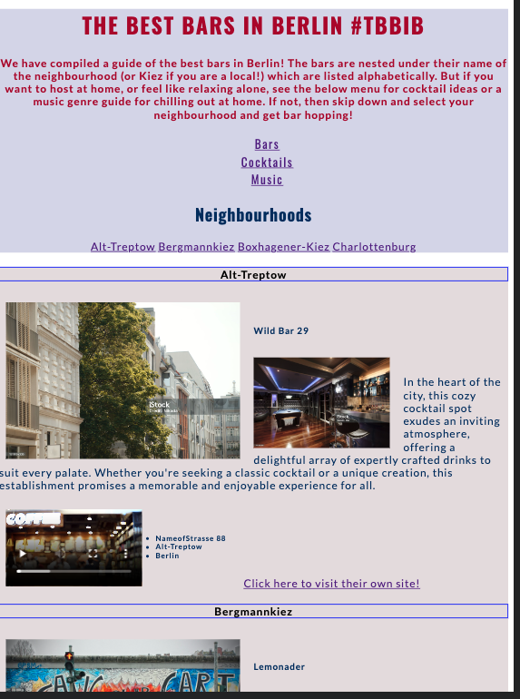
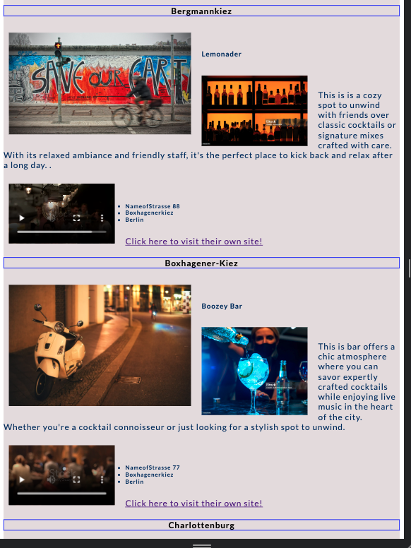
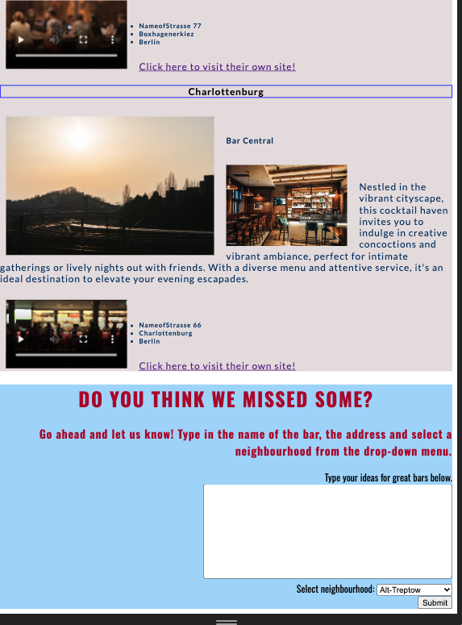
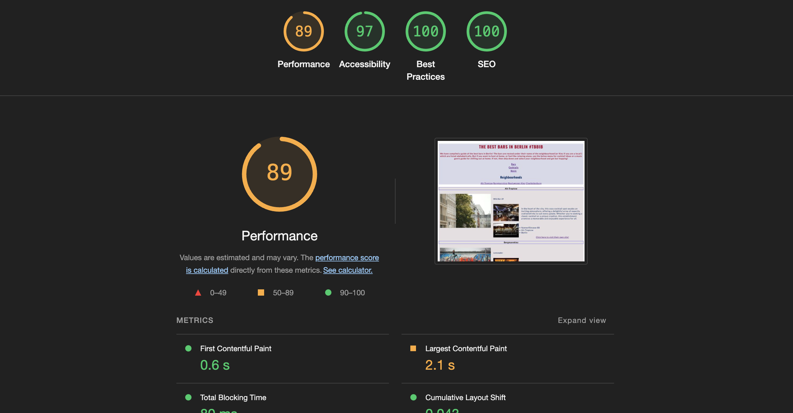

## Welcome, this is the first website I built for my initial project with CodeInstitue.

### The Best Bars in Berlin #TBBIB 

My idea for this project was to build a directory of recommendations for decent bars or nightlife spots, more specifically a cocktail bar, in Berlin. The website also has sections for making cocktails or above decent drinks at home and has music recommendations. Hence why the name of the project is "The Best Bars in Berlin #TBBIB". 

The ideal user would be a new Berlin resident a visiting tourist, who is searching for decent recommendations, or, someone who needs some assistance with hosting something like a housewarming. Ergo, the cocktail recommendations music genres and playlists. Ideally, in the future, bars would pay to be featured more prominently on the website.

I would say the main target audience would be people aged 20 to 50, which makes up about two-thirds of the bar demographic. However, the website was intended to skew to a younger audience, say 20 to 35.

Each page has a  menu that allows you to navigate through them. 

Index page shows the main list of neighborhoods and their respective bars 

Above that there is the menu to navigate through three pages

The third page copies the same structure but has music suggestions.
The second page copies the same structure but has cocktail suggestions.

Each page has a feed back section, for a users suggestions of the outlined categories. 

## Existing Features
The website layout is simple. As, it is my first website, and I largely wrote it myself, before I had access to my IDE. I have placed the Nav bar at the top, as we did in the LoveRunning project, which allows you to access the two secondary pages. These are where I have listed the cocktail recipes and music genre guide. 

Then I have listed the neighborhoods at the top of the page, then when you click them, the page jumps to the relevant section. As this is just an example website, I have only listed 3 neighborhoods in the city center and listed one fake bar name under each. The text included in the description is erroneous and the address is not real. 

I used a variety of image & video stock websites, one image for the neighborhood, and one image and video for the bar. It would be my idea to have a photo of the bar, and then ideally a little video about it, or some other promotional material from the bar. 

There is also a link per bar listing (which goes to a night recommendation website) as an example of where the link to the actual bar would be. 

At the bottom of the first and second pages, there is a feedback form. This is so the user can interact in. a more meaningful way and provide feedback or ideas, specifically for recommendations. 

### Future Features 
As I become more experienced, I would like there to be better-flowing graphics and more user interactions available. Like a review/comment section or perhaps a map feature linked. 

## Manual Testing
I deployed it multiple times to reflect on my own work. 

I used the below validator by entering the code in manaually: 
https://validator.w3.org/nu/

Origninally each page flagged a few issues, mainly as Warning and Info. Some were flagged as Error, specifically around my use of list elements. But fixed all issues, but lost the background color on my second page. Also, I understand that the images will load differently on each screen, but at this moment I have not learned how to compress images. 

Ultimately, I still have a passable accessability score. 

 

Deployed link: https://validator.w3.org/nu/?doc=https%3A%2F%2Fdavidkilty.github.io%2FProjectSubmission1%2F

CSS: https://jigsaw.w3.org/css-validator/validator?uri=https%3A%2F%2Fdavidkilty.github.io%2FProjectSubmission1%2F&profile=css3svg&usermedium=all&warning=1&vextwarning=&lang=en#css

## Deployment 
I deployed the project via the GitHub features. I did this continually throughout the project to see what the final product would look like. I found it the best way to learn.

The site was deployed to GitHub pages as follows:
In the GitHub repository, navigate to the Settings tab
From the source section drop-down menu, select the Master or Main Branch
Once the master or main branch has been selected, the page will be automatically refreshed with a detailed ribbon display to indicate the successful deployment.

https://davidkilty.github.io/ProjectSubmission1/

## Credits 

I originally wrote the website only in HTML, all on a simple w3School tool. I then moved to CodeAnywhere, as per instructed, but lost that code as I did not push it in time before being locked out and moving to GitPod as is now recommended. 

I regret not getting comfortable with the IDE sooner as it was a great help. But I am glad I used W3Schools at first as it was very simple. The fonts are from Google as per learned with CodeInstitue. 

The images are from a variety of sites such as PixBay and other free library stocks. 

The fav icons were downloaded as per the LoveRunning project. 

I often used the Slack channel to see other students tips on fixing issues and Googled problems, relying on such blogs as W3Schools, StackOverflow and MDNWebDocs

I struggled  with the styling, sought advice from other coders and relied on styling from the HTML. 

I used the Code Institute guides and materials exhaustively. 
